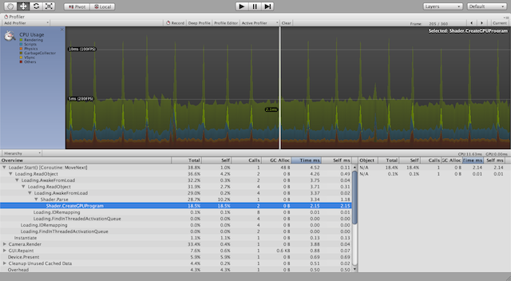
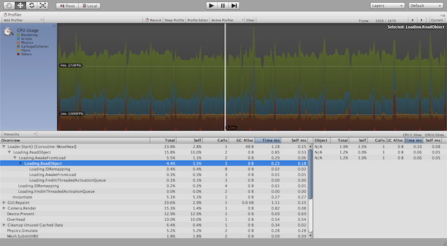

アセットバンドルにシェーダーを含める場合に注意すべきこと
========================================================

Unity のアセットバンドルをヘビーに使い始めると、次のような現象に遭遇することがあります。

- アセットバンドルのロード時に比較的長期間（数十msから数百ms程度）のブロッキングが発生する。

これには複数の原因が考えられますが、可能性の高い原因として「シェーダーのコンパイル」があげられます。

